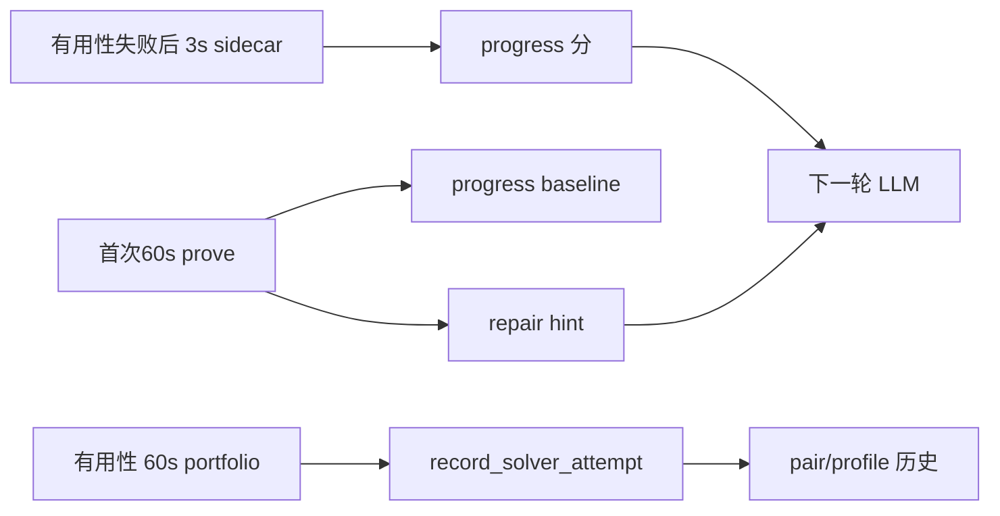

# P1：判定语义被拧歪（说明 + 方案，暂不改代码）

P0 解决的是「信号读不到 / 读错」。P1 是信号已经读到了，但 **门槛叠在一起、相关计数被当成独立证据、60s 和 3s 混比、空 stats 还写 hint**，于是 LLM 和 routing 会拿到看起来很像样、其实语义不对的结论。




- **P1-1**：单次 run 内部 mix → 写成 `need_rewrite` / `need_induction` 等 **repair hint**
- **P1-2**：两次 run 对比 → `compute_progress_score` 的 **strong 计数 / 爆炸惩罚**
- **P1-3**：progress 的 baseline 和 sidecar **协议不一致**
- **P1-4**：有用性那次 60s **没采 stats**，却照样衍生 hint 和 utility

---

## P1-1 Mix 条件叠了两个不等式

意图：看「这次搜索里归纳 vs 重写（Vampire）或 conjecture vs skolem vs inst（CVC）谁占主导」，告诉 LLM 缺哪类引理。

现状（[vampire_runner.py](vampire_runner.py) `derive_repair_hints`、[cvc5_runner.py](cvc5_runner.py) 同名函数）是 **份额 AND 比**，再用 `if/elif` 只留一条。

**Vampire `need_rewrite`**

- 条件：`ind_share ≥ 0.08` **且** `dem/ind < 8`
- `dem/ind < 8` ⇔ `ind/(ind+dem) > 1/9 ≈ 0.111`
- 所以 **0.08 从不单独生效**；真正卡的是「归纳至少约占 11%，且重写还没把归纳淹没」。文案却说「归纳份额大、重写稀缺」。

**Vampire `need_induction`**

- 条件：`dem_share ≥ 0.85` **且** `ind/dem < 0.02`
- 后者要求归纳不到重写的 2% ⇒ demod 份额约 **≥ 98%**
- `ind=8, dem=400`：`dem_share≈0.98` 过了 0.85，但 `8/400=0.02` **不小于** 0.02，**不会**提示缺归纳。文案说的「几乎没归纳」比代码严得多。

**CVC `need_rewrite`**

- `skol_share ≥ 0.01` **且** `inst/skol < 10`
- `skol=100, inst=900`：skolem 不少，每 1 次 skolem 仍有 9 次 inst，代码仍说「实例化稀疏」。10 是绝对比，大题永远容易「小于 10」。

**CVC `need_stronger` vs `need_rewrite`**

- 前者：`conj_share ≥ 0.25` 且 `skol/conj ≤ 0.05`
- 用 `if/elif`：先命中 stronger 就 **掐掉** rewrite，prompt 不说明优先级。

**可选方案**

- **A（推荐，最小改）**：每条 hint 只留一个不等式。Vampire：`need_rewrite` 只留 `dem/ind < 8`（或只留份额）；`need_induction` 只留 `ind/dem < 0.02` **或**放宽到 `ind_share < 0.15` 这类真·「几乎没归纳」。CVC：`need_rewrite` 改成「skolem 已发生且 `inst/skol` **相对 baseline 变低**」，或加活动量下限（例如 `skol+inst` 太小不诊断 mix）。两条允许同时给出，去掉 `elif`。
- **B**：mix 改为 **相对 baseline 的份额变化**（sidecar 才有对照；入口 60s 无对照则不写 mix，只写 difficulty/induction_focus）。语义最干净，但入口 hint 会变少。
- **C**：只改文案和 `elif→if`，门槛不动。最便宜，但 `ind=8,dem=400` 仍不会提示缺归纳。

---

## P1-2 进度分把相关计数当成独立证据

`compute_progress_score` 用 `strong` 计「几条独立进展」；`strong < 2` 且没有 skolem/induction 这类硬信号时，正分打 0.4/0.35 折（`weak_single_signal`）。

问题不在折扣本身，而在 **什么算独立**：

- Vampire：`Fw demodulations` 与 `Fw demodulations to eq. taut.` 几乎总是一起涨，各 +1 `strong`，轻松避开打折。
- CVC：`INST_TOTAL` 与 `CONJ_TOTAL` 高度相关，同样两条 `strong`。
- 爆炸不对称：Vampire 看 generated clauses，且 **demod 增加不算产出**（只认 eq-taut / induction / 被动比）；CVC 用 conjecture-gen 当体积，**INST 暴涨不罚**，只灌实例化的引理仍可能靠 `more_instantiations` 拿正分。
- Vampire 已解析 `Integer*Induction`，hint 里有 `need_arithmetic_lemma`，但 progress **只用** Structural/Generalized/InductionApplications。整数题上结构归纳为 0、区间归纳很高时，进度面是瞎的。

**可选方案**

- **A（推荐）**：合成通道——Vampire `demod`+`eq-taut` 一条 rewrite 信号；`Induction`*+`Integer*Induction` 一条 induction 信号（integer 可用 `rare`）。CVC `CONJ`+`INST` 一条 matching/volume 信号，`SKOLEMIZE`/`DT`/difficulty 仍独立。爆炸：体积暴涨且 **对应产出组无相对增益** 才罚；CVC 在 INST 暴涨且无 skolem/difficulty drop 时罚。
- **B**：只把 taut 并进 demod、integer 并进 induction，爆炸规则不动。改动小，CVC「INST 灌水仍算进展」还在。
- **C**：取消 `strong` 计数，改为加权和 + 上限。更干净，但和现有测试/阈值耦合大。

---

## P1-3 60s baseline 与 3s sidecar 不可比

有用性失败后 [Mate_new.py](Mate_new.py) / [Mate_new_vampire.py](Mate_new_vampire.py) 的 `analyze_lemma_progress`：

- **baseline**：缓存的首次 **60s** prove（CVC 带 stats+difficulty；Vampire 带 `--show_induction`）
- **control / candidate**：各跑 **3s** diagnostic

比的是「每秒 rate」和 difficulty 列表，但搜索深度完全不同：60s 的 INST/demod/induction 通常远高于 3s，引理很容易被当成「退步」或噪声。

另外 CVC `run_cvc_diagnostic` 在 `collect_difficulty=True` 时仍是 **两次进程**（`--stats` 一次 + `run_cvc_difficulty` 一次）。Vampire sidecar 常关 `show_induction`，和入口 prove 的 induction 计数也不可比。

**可选方案**

- **A（文档推荐）**：progress **只比同协议 3s**。首次 60s 后再跑（并缓存）`baseline_diag_short`；control/candidate 用同一 profile、同一超时。60s 的 difficulty/induction **只写 repair hint**。代价：每个目标多一次 3s。
- **B**：sidecar **取消 difficulty 对比**，只比 rate；hint 仍用 60s。更便宜，但 60s vs 3s 的 rate 仍不可比，P1-3 只修了一半。
- **C（可与 A 或 B 叠）**：`run_cvc_diagnostic` 把 `produce-difficulty`+`get-difficulty` 注入 **同一次** `--stats` 进程，去掉第二次 `run_cvc_difficulty`。Vampire sidecar 与 baseline 统一 `show_induction`。无论选 A 还是 B 都建议做。

---

## P1-4 有用性 60s 空 stats 仍写 hint / utility

[Mate_new.py](Mate_new.py) `verify_combined_lemmas`：

```python
full = run_cvc_routed(output_path, timeout=combined_timeout, state=state)
record_solver_attempt(..., result=full)
```

`run_cvc_routed` 默认 `collect_stats=False`。`record_solver_attempt` 仍对这份结果 `derive_repair_hints`（空 stats → 很容易写出空洞 `timeout` hint）和 `profile_utility_from_stats`（零计数 utility 进 pair 历史）。

首次 prove 已开 `collect_stats=True`，问题主要在 **有用性这次 portfolio**。

**可选方案**

- **A（推荐，对齐文档）**：有用性失败 **不要** 从空 stats 的 portfolio 衍生 repair/utility。`record_solver_attempt` 若 `stats` 空：只记 `status/elapsed/strategy`，`signals=[]`，`utility=None`。hint 继续来自首次 prove 缓存 + sidecar。
- **B**：有用性也开 `collect_stats`（可能还要 difficulty）。贵，且 portfolio 多策略混计数，和「同 profile 才可比」冲突。
- **C**：只跳过 `timeout` 类空 hint，utility 仍写。修 prompt，不修 routing 污染。

---

## 建议你怎么选（可改）

若你不想逐条抠：P1-1 **A**，P1-2 **A**，P1-3 **A+C**，P1-4 **A**。这和 [docs/feedback_fix_plan.md](docs/feedback_fix_plan.md) 批次 2–3 一致。

请回复四条选择（例如「P1-1 A，P1-2 B，P1-3 A+C，P1-4 A」）。确认后再改代码；本轮不动仓库。