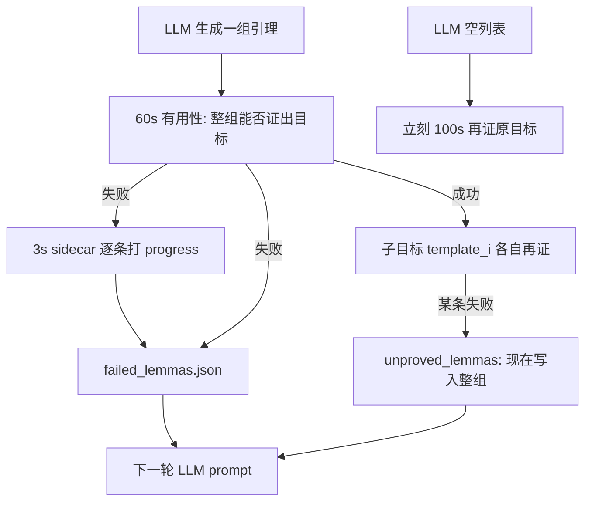

# P2：闭环里功劳、提示窗口、控制流（说明 + 方案）

P0 解决「信号读不到 / 读错」。P1 解决「读到了但门槛语义不对」。P2 是信号已经进了 `failed_lemmas.json`，但 **写回下一轮 prompt 时说法打架、窗口挤掉关键 hint、空回复白烧 100s、记错是哪条引理挡路、probe 仍可能用绝对爆炸门槛、没有 `set-logic` 就打不开 difficulty**。

对照代码后：**P2-1～P2-4、P2-6 仍在**。**P2-5 只修了一半**：入口 probe 已经会选一个 reference profile 做相对比较，但 `profile_utility_from_stats` 的无对照分支、以及 [`record_solver_attempt`](../Mate_new.py) 仍走 `gen > 2000` / `conj > 400`。P1-4 减少了空洞 timeout hint，但 **挡不住** `no_progress` 把 60s 结构 hint 挤出 4 格窗口（P2-2）。

名词（后面会反复用）：

- **引理 / lemma**：LLM 提出的辅助断言，希望帮求解器证出原目标。
- **有用性检查**：把一组引理加进原问题，看求解器能否在超时内证出目标。
- **sidecar**：有用性失败后的 3 秒诊断，一条一条看搜索统计有没有「进展」。
- **progress**：相对 baseline/control，搜索更「像样」（归纳/重写/难度下降），**不等于已经证出**。
- **useless group**：这一组搭配没能证出目标；不是宣布每条公式都永远无用。
- **repair hint**：给 LLM 的修理建议（缺重写、缺归纳、难度高等）。
- **probe**：首次 LLM 前，对几个求解器策略各跑约 2 秒，用来排序，不当证明。
- **reference profile**：probe 里当对照的那条策略；别的策略只跟它比相对增益。
- **子目标**：有用性通过后，每条引理变成自己的证明义务（文件名 `template_1` = 第 1 条）。
- **unproved / useful_but_unproved**：帮父目标有用，但自己超时；应弱化/补桥，不要当 invalid 丢掉。

---

## P2-1 progress 与 useless 对 LLM 说法相反

意图：整组证不出时，告诉 LLM「别原样再吐这一组」；若某条单独让搜索变好，让它 refine 这条。

现状（[`verify_combined_lemmas`](../Mate_new.py) + [`format_solver_feedback_for_prompt`](../Mate_new.py)）：

- 整组写入 `useless_lemma_groups`，prompt：**DO NOT generate the exact same group**
- sidecar 按 **单条** 打分，过阈值写入 `progress_lemmas`，prompt：**Prefer refining or extending these**
- 同一批公式可以同时出现在两栏

后果：

- 只在组合里才有用的 **桥接引理**（单独几乎没信号）评不到，下一轮被冷落。
- 单独好看、整组仍无用的 lemma 被强化；LLM 容易再生成同一条，只改同伴。
- 平凡式过滤只认 `(= t t)`（[`_is_trivial_equational_lemma`](../Mate_new.py)）。`(=> P P)`、以及 control 同型的 `(forall ((x T)) (= x x))` 仍可能进诊断。

**可选方案**

- **A（推荐，已落地）**：评分仍可按单条做（sidecar 成本在这），但写 prompt 时分清两层：useless = **这一组搭配不够**；progress = **单条相对 control 的搜索变化，不能代替整组有用**。同一轮刚失败的组成员若出现在 progress，文案改成「可 refine，但不要整组原样重发」。扩展 trivial：`(= t t)`、`(=> P P)`、与 `_control_lemma` 同型的 `(forall ((x T)) (= x x))`。
- **B**：本轮 useless 组的成员 **不写入** `progress_lemmas`（只留更早轮次的 progress）。叙事最干净，但会丢掉「这条方向对、组配错了」的信号。
- **C**：只改 prompt 两句说明，trivial 检测不动。最便宜；control 同型恒真仍可能进 sidecar。

---

## P2-2 repair hint 只保留最后 4 条，按插入序截断

[`add_repair_hints`](../Mate_new.py)：去重键 `(kind, detail[:80])`，然后 `existing[-4:]`。

入口 60s 的 `high_difficulty` / `induction_stuck` / `need_rewrite` 先写入；有用性失败再追加 `no_progress` / `partial_progress` / `timeout`（不同 `context` 的同类 timeout **各占一格**）。后到的挤掉结构 hint。

P1-4 只挡住 **空 stats 的 portfolio timeout**；`no_progress` 照样能占满窗口。

**可选方案**

- **A（推荐，已落地）**：按 **kind 去重保留最新**。窗口改配额：结构类（difficulty / induction_focus / mix）固定留 2；本轮进展类（no_progress / timeout / partial_progress）最多 2。不要 `[-4:]`。
- **B**：窗口改成 8，仍按插入序。hint 变多，挤掉问题减轻但不消失。
- **C**：只按 kind 去重、仍总共 4 条。不同 context 的 timeout 不再占两格，但 `no_progress` 仍可能挤掉 `high_difficulty`。

---

## P2-3 空 LLM 输出每次 attempt 立刻 100s 再证原目标

[`prove_run`](../Mate_new.py) 每个节点：2 个 prompt × 默认 3 次 attempt。

- **调用抛错 / 缺 Output 标记**（`parse_llm_response` 抛 `ValueError`）：外层 `except` → **下一 attempt，不加时**。
- **标记在、但抽不出 forall**（返回 `[]`）：[`quick_run`](../Mate_new.py) 立刻 `run_cvc_routed(..., RETRY_CVC_TIMEOUT=100)`。

空列表不是「求解器差 40 秒就证得出」，只是 LLM 没给出可用公式。最坏每个节点 6×100s，且发生在生成循环里，不是「全部 attempt 用尽后再加一次」。

**可选方案**

- **A（推荐，已落地）**：空列表与调用失败一样进入下一 attempt；**该节点全部 LLM attempt 失败后最多加时一次**。
- **B**：空列表永不加时。最省预算；会丢掉偶尔「再跑 100s 就能证」的题。
- **C**：每个节点只允许第一次空列表加时。比现状好，仍可能在第 1 次空回复上白烧 100s。

---

## P2-4 子目标失败把父组所有 lemma 记成 unproved

有用性通过后，[`generate_formal_proof_files`](../Mate_new.py) 把第 i 条写成 `{父名}_{i}.smt2`（`template` → `template_1`, `template_2`）。

某子目标失败时 [`_record_subgoal_failure_feedback`](../Mate_new.py) 对 **`parent_lemmas` 每一条** 都 `add_unproved_lemma(..., blocking_subgoal=失败那个)`。

挡住的可能只是 `template_2`；LLM 会看到整组都是「有用但不可证」，去弱化其实已经证过的同伴。

**可选方案**

- **A（推荐，已落地）**：用文件名对齐：`blocking` 若为 `{parent}_{k}` 且 k 是数字，只标记 `parent_lemmas[k-1]`；对不上则只写 `subgoal_failed` hint、不写 unproved 列表。
- **B**：不再写入 `unproved_lemmas`，只保留 `subgoal_failed` hint（含子目标名）。prompt 变短，LLM 看不到具体公式。
- **C**：整组仍记录，但只有 blocking 那条 `status=useful_but_unproved`，其余标 `sibling_not_blocking`，prompt 只展示 blocking。改动小，JSON 仍会膨胀。

---

## P2-5 Probe 无 reference 时退回绝对阈值

[`profile_utility_from_stats`](../solver_routing.py)：有 `reference_stats` 走相对增益；否则 Vampire `gen > 2000 and 无归纳`、CVC `conj > 400 and skol≤1 and inst<30` 扣爆炸分。这正是相对化要消掉的「大题永远像爆炸、小题永远不像」。

**已缓解：** [`seed_baseline_repair_hints`](../Mate_new.py) 会对非对照 profile 传入 reference。对照自己打 0 分，不走绝对分支。

**仍在：**

- 无 reference 的代码分支还在；[`tests/test_solver_routing.py`](../tests/test_solver_routing.py) 还在测 `gen=8000` 爆炸。
- `record_solver_attempt` 算 pair 历史 utility 时 **不传** reference（有 stats 就会走绝对门槛）。

**可选方案**

- **A（推荐，已落地）**：删掉绝对 `> 2000 / > 400`。无对照时只按 status（error 负分、timeout 小罚、否则 0）+ 理论静态序。probe 继续传 reference。`record_solver_attempt` 无对照则 `utility=None`（与 P1-4 空 stats 一致），或传入缓存的 paper-profile probe。
- **B**：无对照时在「本题已跑过的其它 profile」里找对照；找不到才 status-only。probe 更稳，attempt 记录要多一次查找。
- **C**：probe 路径禁止绝对门槛（现状已基本如此）；attempt 记录仍可用绝对分。修排序、不修 pair 历史污染。

---

## P2-6 `produce-difficulty` 只插在 `(set-logic` 之后

[`_inject_difficulty_script`](../cvc5_runner.py) 只在 `(set-logic` 行后插入 `(set-option :produce-difficulty true)`；`get-difficulty` 仍跟第一条 `(check-sat)`。

没有 `set-logic` 的 SMT（部分手工/预处理文件）**不会打开** difficulty，`get-difficulty` 可能报错，整条难度信号为空。P0-1 已能解析嵌套 s-expr，但选项没打开则解析不到任何东西。

**可选方案**

- **A（推荐，已落地）**：若没有 `set-logic`，在首条非注释命令**之前**插入 `produce-difficulty`。不要插在其后：第一条命令本身可能已是 `(assert …)`，option 落在约束后面时 cvc5 可能拒收，或漏记该断言的难度。`get-difficulty` 仍紧跟第一条 `check-sat`。
- **B**：文件开头无条件插入该 option。实现最简单；个别 solver 对「option 出现在 set-logic 前」敏感时可能告警。
- **C**：没有 `set-logic` 就不要注入 `get-difficulty`，避免报错。信号继续缺，只是不再把 error 当成 timeout。

---

## 建议你怎么选（可改）

若不想逐条抠：P2-1 **A**，P2-2 **A**，P2-3 **A**，P2-4 **A**，P2-5 **A**，P2-6 **A**。这和 [feedback_fix_plan.md](feedback_fix_plan.md) 批次 4 一致。

## 落地

已按上表全部 A 实现。P2-6 原稿写「插在首条非注释命令之后」不成立，代码与本文均改为插在**之前**。
