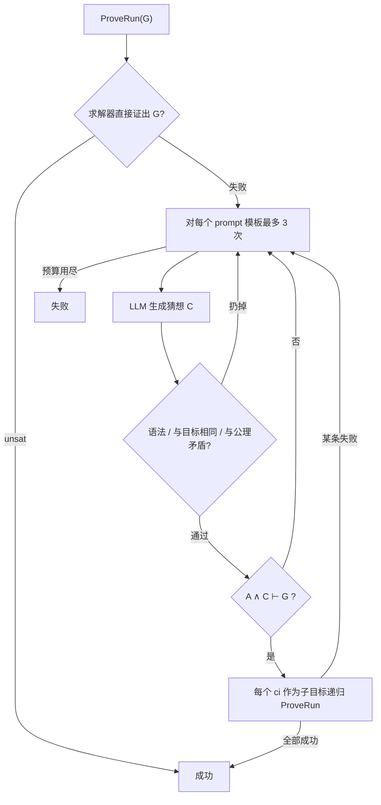
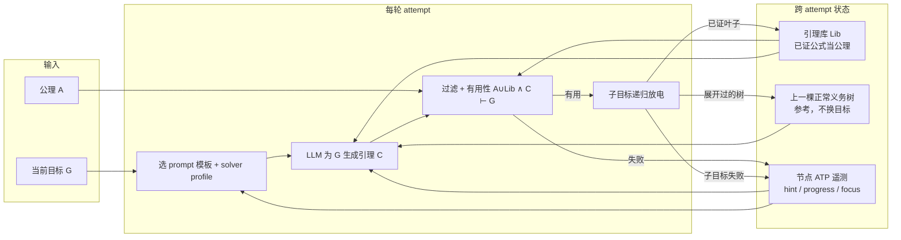
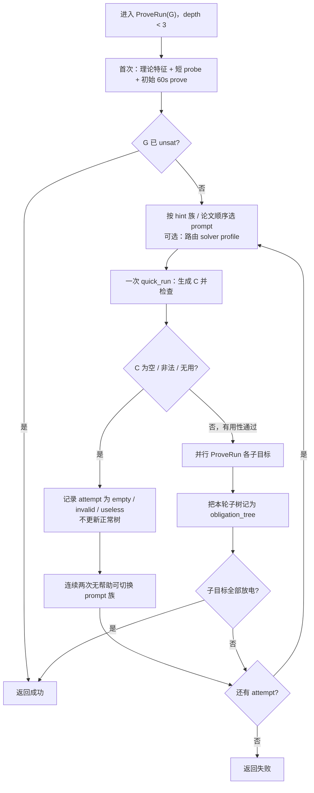
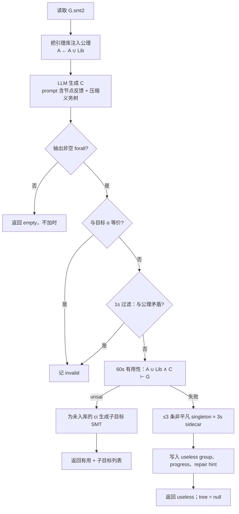
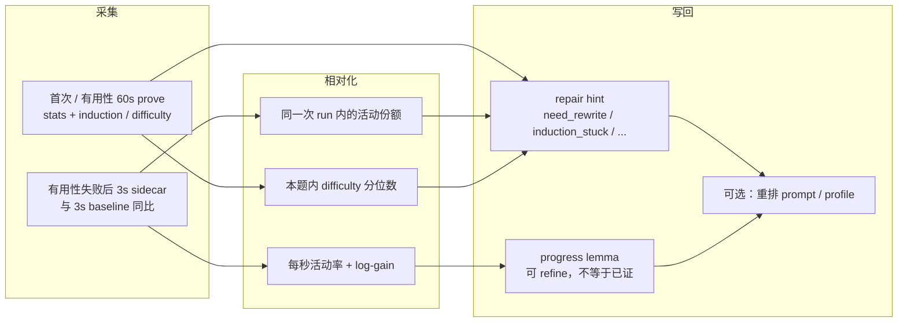
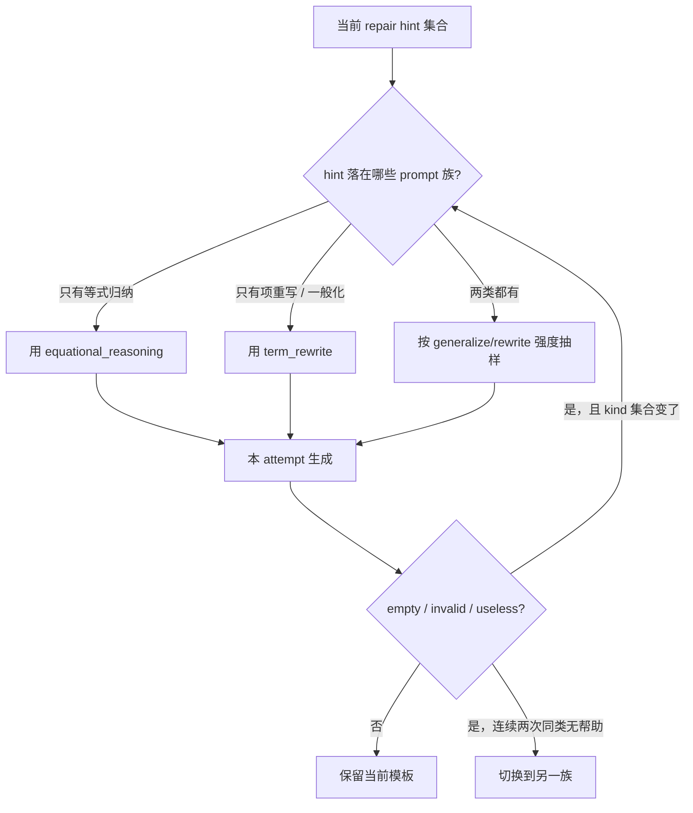
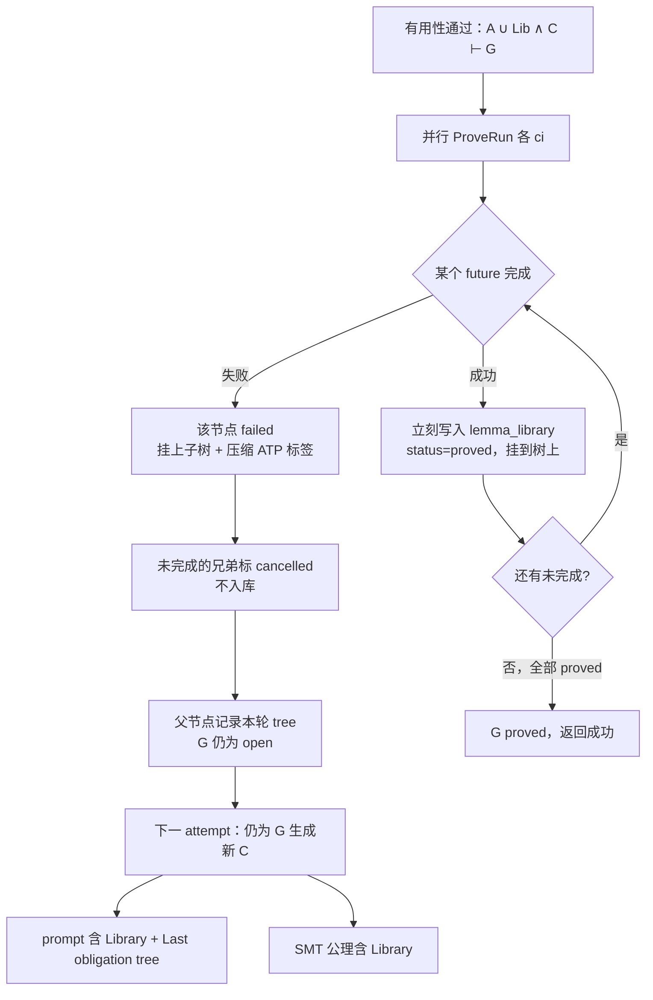
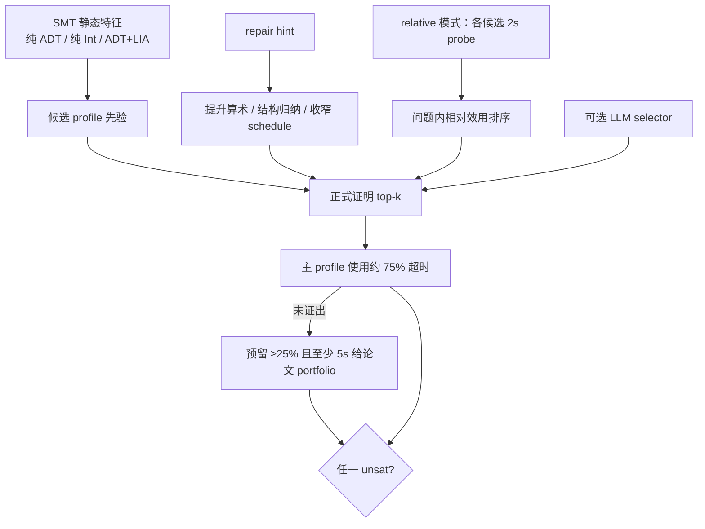
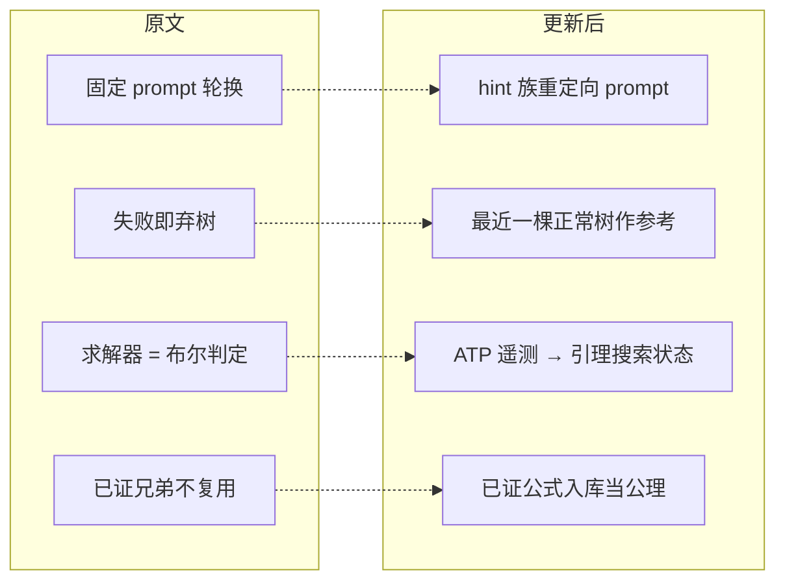

# 更新后的算法与创新点

本文说明当前实现相对原文 LLM4Ind / ProofMate（FM 2026）的算法全貌。证明判定没有改：仍然只有求解器返回 `unsat` 才算成功。改动发生在**失败之后搜什么、记住什么、下一轮为当前目标生成什么引理**。

原文闭环把求解器当布尔判定器：失败就丢掉这一组猜想，换同一套提示再问 LLM。更新后的方法把失败变成两类可继承状态：

1. **节点级 ATP 遥测**：当前目标为什么卡住（重写不足、归纳卡住、算术、难度高等）。
2. **树级义务历史**：上一轮真正展开过的递归分解——哪些引理已证、哪条边失败、哪些被取消——以及已放电引理组成的题级库。

新 attempt 仍然只为**当前节点的目标 \(G\)** 生成引理，不会跑到失败子目标上续证。

反馈各通道如何进入 prompt / 路由，以及 progress（已是 cand vs baseline）与 repair 细 kind（仍是单次 mix）的指标设计：[当前反馈闭环与指标设计.md](当前反馈闭环与指标设计.md)。

---

## 1. 原文算法（对照基线）

原文 Algorithm 1 / 2 的合同是：找一组辅助引理 \(C=\{c_i\}\)，使得

\[
A \land C \vdash G,\qquad \text{且每个 } c_i \text{ 可递归证明。}
\]



特点：

- 两种结构化 prompt（等式归纳推理 / 项重写一般化）固定轮换。
- 求解器配置固定：CVC5 四路 portfolio，Vampire `--schedule induction`。
- 失败只改变控制流（进入下一次 LLM 尝试），**不改变**下一轮该生成什么形状的引理。
- 已证兄弟、失败子树、ATP 统计都不进入下一轮。attempt 之间相互独立。

---

## 2. 更新后算法总览

每个目标节点仍执行 `ProveRun(G)`。节点内部增加三块局部状态，跨 attempt 保留：

| 状态 | 存放 | 作用 |
|------|------|------|
| 节点反馈 `failed_lemmas.json` | 当前目标 | repair hint、progress lemma、invalid / useless group |
| 义务历史 `obligation` | 当前目标 | 各次 attempt 的种类；最近一棵展开过的义务树 |
| 引理库 `lemma_library.json` | 整题共享 | 已完全放电的定理，注入后续 SMT 公理 |



原则（相对原文没有放松）：

- 成功条件仍是 \(A \cup \mathrm{Lib} \land C \vdash G\)，且每个尚未入库的 \(c_i\) 递归可证。
- 反馈只影响**搜索顺序与下一轮生成对象**，不参与逻辑有效性判断。
- 父节点下一轮仍对 \(G\) 做分解；修理失败子目标属于那个子节点自己的 `ProveRun`。

---

## 3. `ProveRun`：节点主循环

深度上限默认 3。进入节点后先做一次 routed 初始验证（默认 60s）。证出则返回成功。否则在共享预算内循环（默认 2 个 prompt 模板 × 各 3 次，共 6 次）。



与原文的三处控制流差异：

1. **空列表不加时。** LLM 没抽出 `forall` 时进入下一次 attempt，不再立刻用 100s 再证原目标。
2. **Prompt 可重定向。** `PROMPT_RETARGET=on` 时，hint 族决定起始模板；两类 hint 同时存在则按强度抽样；连续两次 empty/invalid/useless 才切换另一族。关闭则回到论文的「先模板 A 三次、再模板 B 三次」。
3. **有用性失败不搜子集。** 只做一次整组 \(A \land C \vdash G\)；失败后用短 sidecar 写 progress，而不是枚举子集再证明。

---

## 4. 单次 attempt：`quick_run`

一次 attempt 的合同不变：为**当前 \(G\)** 提出 \(C\)，过滤后看能否帮助证明 \(G\)。若能，把尚未入库的引理写成子目标文件。



求解器侧，库中公式已经是公理，不必再当子目标。LLM 侧仍被要求为 \(G\) 写**新**引理：可以引用库 id、弱化曾经有用但不可证的公式、或换一种切分，但不能把证明对象换成失败孩子。

---

## 5. 创新点一：ATP 失败遥测 → 引理搜索状态

原文求解器几乎只给 `unsat` / 失败。ITP 里可以用 proof state 修 LLM；归纳 SMT / ATP 没有那种状态机，只有饱和统计、归纳焦点、`get-difficulty`。这一层把**黑盒失败遥测**变成下一轮引理该怎么长。

### 5.1 信号从哪来



相对化的原因：绝对门槛（如 `INST > 50`、`demod > 100`）在小组 Nat 题上永远不触发，在大 ADT/整数题上又总是触发。现在比的是**同一问题内部**的比率和对数增量，小任务 `INST 12→30` 和大任务 `INST 10000→10040` 不再共用一个计数地板。

| 通道 | Vampire | CVC5 |
|------|---------|------|
| 重写 / 匹配 | demodulation、eq-taut 合成一条 rewrite 信号 | skolem / instantiation 份额 |
| 归纳 | 结构归纳 + 整数区间归纳 | datatype / well-founded induction、conjecture-gen |
| 难度 | 归纳焦点项 | `get-difficulty` 的本题中位数 hard axioms、目标难度下降 |
| 爆炸 | 子句体积暴涨且无对应产出 → `search_explosion` | INST/conjecture 灌水且无 skolem/difficulty drop |

### 5.2 hint 如何约束下一轮（而不只是贴日志）

同一条 hint 同时影响引理形状和（若开启路由）求解器配置，但语义不同：

| hint | 对引理生成 | 含义 |
|------|------------|------|
| `induction_stuck` | 针对 focus 项写等式桥 | 归纳在这些项上卡住 |
| `need_rewrite` / `need_directed_rewrite` | 左侧匹配目标子项的重写引理 | 搜索里归纳/skolem 多、改写少 |
| `need_induction_lemma` / `need_stronger_lemma` | 优先一般化 / 更强归纳假设 | 重写或 conjecture 占主导、归纳太弱 |
| `need_arithmetic_lemma` | 递推、单调性、界 | 整数归纳份额高 |
| `search_explosion` | 更小、更局部的桥 | 体积变大但没有有效产品 |
| `useful_but_unproved` | 弱化该条或补桥，不要当 invalid 丢掉 | 对 \(G\) 有用，自身超时 |
| `high_difficulty_assertions` | 连接高难度公理与目标 | CVC5 本题内最难的断言 |

写回 prompt 时分清两层，避免说法打架：

- **useless group**：这一**组搭配**没能证出 \(G\)，不要整组原样重发。
- **progress lemma**：单条相对 control 让搜索变像样，**不等于**已经有用；若它属于刚失败的组，文案是「可 refine，不要整组重发」。

子目标失败只标记 **blocking 那一条** 为 `useful_but_unproved`，不再把整组都写成不可证。

### 5.3 Prompt 重定向（控制流，不是多一段文字）

默认开启 `PROMPT_RETARGET`：



这是相对原文 Algorithm 1 的结构变化：失败之后**搜索对象**（用哪类引理语言）可以变，而不只是「再用同一模板重采样」。消融时可关 `PROMPT_RETARGET`，回到论文顺序。

---

## 6. 创新点二：跨 attempt 的义务树 + 引理库

节点统计解释「当前 \(G\) 为什么卡住」。它解释不了「上次怎样切 \(G\)、哪些叶子已经能用、哪条边挡住」。原文失败即弃树；现在把**最近一棵真正展开过的递归义务树**和**已放电定理**留给下一轮。

### 6.1 什么算「正常树」

每次 attempt 记一种 `kind`：

| kind | 何时 | 是否更新 `last_normal_tree` |
|------|------|------------------------------|
| `empty` | LLM 空列表 | 否 |
| `invalid` | 与目标相同或与公理矛盾 | 否 |
| `useless` | 有用性失败，没有子目标 | 否 |
| `obligation_tree` | 有用性通过并展开了递归 | **是**（即使整题还没证完） |

向前追溯时跳过 empty / invalid / useless，取最近一个 `obligation_tree`。空输出和「差一点证完」必须分开：后者才有可参考的分解史。

### 6.2 树与库的生命周期



两条硬规则：

1. **入库 = 整棵子树成功。** 中间节点失败时，只有已经 `proved` 的后代进库；失败节点本身不进库。`useful_but_unproved` 和仅有 progress 的公式都不是定理。
2. **参考树最多一棵，且必须是 `obligation_tree`。** 不把历次失败组、空 attempt 拼成森林塞进 prompt。

并行下第一个失败会 cancel 兄弟：已经跑完且成功的兄弟仍是定理，失败返回前就要写入库。被 cancel、没跑完的标 `cancelled`。

### 6.3 压缩进 prompt 的形状

不传整份 JSON。LLM 看到的是注释块：公式本身、证明状态、少量可操作标签（hint 种类 + induction focus）。

```text
; OBLIGATION HISTORY: generate lemmas for the CURRENT goal only.
; Library formulas are already axioms. Do not resend a failed split;
; you may reuse proved lemmas, weaken a failed lemma, or choose a new split.
; Library (already proved, in axioms):
;   lib_1: (forall ((x Nat)) (= (plus x zero) x))
; Last obligation tree (attempt 3; for reference only):
;   G  open
;   ├─ lib_1  proved  (forall ((x Nat)) (= (plus x zero) x))
;   └─ L2  failed  [need_rewrite; focus: (plus x y)]  (forall ((x Nat) (y Nat)) (= (plus x y) (plus y x)))
;        ├─ lib_2  proved  (forall ((x Nat)) (= (plus zero x) x))
;        └─ L2_2  cancelled  ...
```

语义分工：

| 信息 | 告诉 LLM 什么 | 不允许做什么 |
|------|----------------|--------------|
| Library | 这些公式已经是公理，不必重造 | 再生成 α 等价副本 |
| 树的 `proved` 叶 | 上次这种切分有一部分立住了 | — |
| 树的 `failed` 节点 + ATP | 这种子目标过强或缺桥；focus 提示卡在哪 | 把证明目标换成该子节点 |
| `cancelled` | 没跑完，不要当成反例 | 假设它不可证 |

父节点参考的是 **\(G\) 的分解历史**，不是一张「从失败孩子接着证」的地图。合理的下一轮动作都落在 \(G\) 上：保留已证、换一组分解、或把「曾经有用但不可证」的公式改弱后仍作为 \(G\) 的引理。

子节点自己的 `ProveRun` 用同一套结构：库是全题共享的；`last_normal_tree` 是**该节点**自己的上一棵正常树。孩子修孩子的目标，父节点不会去对准 open 孩子。

### 6.4 树节点字段

```text
node:
  id        template / template_1 / template_1_2   （与现有文件命名对齐）
  role      goal | lemma
  formula   引理 SMT；根目标不重复贴整份问题
  status    proved | failed | cancelled | open
  lib       仅 proved 时指向 lemma_library 的 id
  atp       仅 failed：至多 3 个 hint kind、2 个 focus 项
  children  该节点自己的递归；叶（首次 prove 即 unsat）为空
```

---

## 7. 辅助机制：求解器 profile 路由

路由**不是**这篇方法的主创新；它与同一套 hint 共享信号，改变的是预算分配。`SOLVER_ROUTING=off` 时完全回到论文 portfolio，可单独消融。



父目标与子目标允许使用不同 profile；子目标可继承父 profile 作为优先候选。证明成功条件仍然只认 `unsat`，selector 不能判定有效性。

---

## 8. 一次完整失败—再生成的例子

目标：证明 `plus` 交换律。第一次 attempt 提出 \(C=\{L_1, L_2\}\)，有用性通过，但 \(L_2\) 自身超时。

```mermaid
sequenceDiagram
  participant P as ProveRun(G)
  participant L as LLM
  participant S as 求解器
  participant K as 引理库
  participant T as 义务树

  P->>S: 初始 60s prove G
  S-->>P: unknown + stats
  P->>L: 节点 hint（尚无树）
  L-->>P: C = {L1, L2}
  P->>S: A ∧ C ⊢ G ?
  S-->>P: unsat（有用）
  par 并行子目标
    P->>S: ProveRun(L1)
    S-->>P: unsat
    P->>K: 写入 lib_1 = L1
    P->>S: ProveRun(L2)
    S-->>P: timeout
  end
  P->>T: G open; lib_1 proved; L2 failed
  Note over P,L: 下一 attempt 仍为 G 生成
  P->>L: Library + Last tree + L2 的 need_rewrite
  L-->>P: 新的 C'（可含弱化的 L2'，不再原样发 L1）
  P->>S: A ∪ {lib_1} ∧ C' ⊢ G
```

若第二次有用性失败（没有递归），attempt 记为 `useless`，`last_normal_tree` 仍指向第一次那棵树。LLM 不会丢掉「\(L_1\) 已经能用、\(L_2\) 这种切分过强」这一事实。

---

## 9. 与原文对照：改了什么、没改什么



| | 原文 | 现在 |
|--|------|------|
| 证明标准 | \(A \land C \vdash G\) 且各 \(c_i\) 可证 | 相同，公理侧变为 \(A \cup \mathrm{Lib}\) |
| 新 attempt 的证明对象 | 当前 \(G\) | 仍是当前 \(G\) |
| 失败后 LLM 看到什么 | 几乎只有「再试一次」 | 节点 hint/progress + 库 + 一棵压缩树 |
| 已证引理 | 丢弃 | 题级库，后续 SMT 直接断言 |
| 有用但不可证 | 常被当成 invalid 丢掉 | `useful_but_unproved`，提示弱化/补桥 |
| 空 LLM 输出 | 可能立刻 100s 再证 \(G\) | 进入下一 attempt |
| 求解器配置 | 固定 portfolio | 默认可路由；可关 |

不要当成方法贡献的部分：Vampire `is-*` 改写、difficulty 括号解析、相对化门槛修对、hint 窗口配额、sidecar 与 60s 不可比等。那些是把闭环做对，不是新问题。

---

## 10. 创新点如何收成一条主张

适合写成方法贡献的一句话：

> 在保持 `unsat` 为唯一证明标准的前提下，把 ATP 失败从二元有用性扩展为带操作的引理搜索状态：节点级遥测标注当前义务为什么卡住；树级继承把上一轮递归结果变成下一轮的先验（保留已证、参考失败切分）。新 attempt 仍只为当前目标生成引理。

两层缺一不可：

- **只有节点统计**：没有跨 attempt 的义务结构，解释不了「哪条引理挡住、哪些已经能用」。
- **只有树、没有 ATP 标注**：看得见卡在哪条边，看不见卡的是重写、归纳还是算术。

求解器 routing、LLM profile selector 建议作为实现细节或消融，不要和上面那条主张抢篇幅。

可独立开关（除 `FEEDBACK_PROGRESS` 默认关外，其余默认开；PaperMate 对照把它们关掉）：

```text
FEEDBACK_REPAIR_HINTS   节点 repair hint 写进 prompt
FEEDBACK_PROGRESS       3s sidecar 与 progress lemma（默认关）
PROMPT_RETARGET         按 hint 族选择 / 切换生成模板
UNPROVED_NOT_INVALID    子目标失败记 useful_but_unproved
LEMMA_LIBRARY           已证公式入库并注入公理
OBLIGATION_TREE         记录并展示上一棵正常义务树
SOLVER_ROUTING          top-k profile + 论文 portfolio 回退
```

主消融建议：`P0`（全关）vs `F1`（节点反馈，不开树/库/路由）vs `T1`（节点反馈 + 树 + 库）。路由单独做 `F1 vs R1`。
